<div align="center">


# 👋 Hello, I'm **Inayat Ullah**
### 🚀 Full Stack Developer | System Architect | Tech Content Creator


[](https://www.linkedin.com/in/inayat-ullah-927b09146/)
[](https://www.youtube.com/c/ExplaineRKhaN)
[](#)

</div>

---

## 🎯 **About Me**

```javascript
const inayat = {
    location: "Pakistan 🇵🇰",
    experience: "5+ Years",
    role: "Full Stack Developer & System Architect",
    passion: ["Clean Code", "Scalable Architecture", "Knowledge Sharing"],
    
    currentFocus: {
        backend: ["Laravel", "PHP", "System Design"],
        frontend: ["Vue.js", "JavaScript", "Responsive Design"],
        mobile: ["Flutter", "Dart"],
        databases: ["MySQL", "SQL Server"],
        learning: ["Machine Learning", "Cloud Architecture"]
    },
    
    motto: "Building tomorrow's solutions with today's technology"
};
```

## 💼 **Professional Expertise**

<table>
<tr>
<td width="50%">

### 🎨 **Frontend Development**
- Modern JavaScript (ES6+)
- Vue.js & Component Architecture
- Responsive Web Design
- Bootstrap & CSS Frameworks
- User Experience Optimization

</td>
<td width="50%">

### ⚙️ **Backend Development**
- Laravel Framework Mastery
- PHP Advanced Concepts
- RESTful API Design
- Database Architecture
- System Design Patterns

</td>
</tr>
<tr>
<td width="50%">

### 📱 **Mobile Development**
- Flutter Cross-Platform Apps
- Dart Programming
- State Management
- Native Performance
- App Store Deployment

</td>
<td width="50%">

### 🔧 **Additional Skills**
- System Architecture Design
- Database Design & Optimization
- Version Control (Git)
- Agile Development
- Technical Documentation

</td>
</tr>
</table>

## 🛠️ **Technology Stack**

<div align="center">

### **Languages**


### **Frameworks & Libraries**


### **Databases & Tools**


</div>

## 📊 **GitHub Analytics**

<div align="center">
  
  
</div>

<div align="center">
  
</div>

<div align="center">
  
</div>

## 📦 **Open Source Contributions**

<div align="center">

### **Published Packages**

<table>
<tr>
<td align="center" width="33%">


**[Digital Invoicing](https://packagist.org/packages/fbr/digital-invoicing)**

🧾 Laravel package for digital invoice generation and management

[](https://packagist.org/packages/fbr/digital-invoicing)
[](https://packagist.org/packages/fbr/digital-invoicing)

</td>
<td align="center" width="33%">


**[Vue3 Hijri Gregorian DatePicker](https://www.npmjs.com/package/vue3-hijri-gregorian-datepicker)**

📅 Vue3 component for dual calendar system support

[](https://www.npmjs.com/package/vue3-hijri-gregorian-datepicker)
[](https://www.npmjs.com/package/vue3-hijri-gregorian-datepicker)

</td>
<td align="center" width="33%">


**More Packages**

🚀 Currently developing additional open-source solutions

[](https://github.com/inaat)

</td>
</tr>
</table>

</div>

## 🏆 **Achievements & Highlights**

<div align="center">

[](https://github.com/ryo-ma/github-profile-trophy)

</div>

- 🎯 **5+ Years** of professional development experience
- 🚀 **50+ Projects** successfully delivered
- 📦 **Open Source Contributor** with published packages
- 📺 **Tech Content Creator** sharing knowledge on YouTube
- 🏗️ **System Architecture** specialist with scalable solutions
- 🌟 **Mentored** 20+ junior developers
- 🌍 **International Reach** - Packages used globally

## 📈 **Current Focus**

```mermaid
graph LR
    A[🎯 Current Goals] --> B[Machine Learning]
    A --> C[Cloud Architecture]
    A --> D[Advanced Flutter]
    A --> E[System Design]
    
    B --> B1[AI Integration]
    C --> C1[AWS/Azure]
    D --> D1[State Management]
    E --> E1[Microservices]
```



## 📫 **Let's Connect & Collaborate**

<div align="center">

### **I'm always interested in:**
🤝 **Collaborating** on innovative projects  
💡 **Sharing knowledge** and best practices  
🌟 **Mentoring** aspiring developers  
🚀 **Building** scalable solutions  

---

**"Code is like humor. When you have to explain it, it's bad."** - Cory House

[](https://www.linkedin.com/in/inayat-ullah-927b09146/)
[](https://www.youtube.com/c/ExplaineRKhaN)
[](mailto:inayat@example.com)

</div>

---

<div align="center">
  


  **⭐ If you like my work, consider giving my repositories a star!**
</div>
